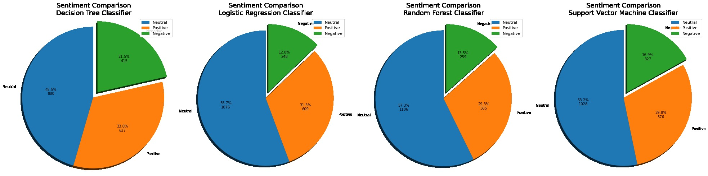

# Analisis Sentimen Tweet Mandalika

Project Natural Language Processing: **Analisis Sentimen Komentar Masyarakat terhadap Sirkuit Mandalika pada Media Sosial Twitter**
     
Abstrak - Sirkuit Mandalika ramai diperbincangkan di dunia maya khususnya media sosial Twitter. Semua pengguna bebas berpendapat atau berkomentar tentang sirkuit Mandalika terutama ketika masa pembangunannya dimana dibangun ketika masa pandemi Covid-19 sampai ketika sirkuit Mandalika digunakan pada ajang balapan MotoGP tahun 2022 sehingga memunculkan banyak pengguna yang berkomentar. Sebagian diantaranya menujukkan komentar yang positif atau mendukung adanya sirkuit Mandalika, namun tidak sedikit pula yang memberikan opini negatif. Twitter menjadi media sosial yang populer digunakan sebagai alat untuk memberikan komentar-komentar atau opini pada suatu topik perbincangan yang hangat. Penelitian ini menggunakan 3000 dataset tweet yang menyinggung sirkuit Mandalika dengan kata kunci “Mandalika” dan berbahasa Indonesia. Dalam proses klasifikasinya membandingkan beberapa metode untuk dibandingkan seperti _Decision Tree Classifier, Logistic Regression, Random Forest Classifier, dan Support Vector Machine_.

## Table of Contents

1. [Latar Belakang](#1-latar-belakang)
2. [Dataset](#2-dataset)
3. [Metode](#3-metode)
4. [Implementasi dan Hasil Metode](#4-implementasi-dan-hasil-metode)
   - [Crawling Data Twitter](#41-crawling-data-twitter) 
   - [Preprocessing Data](#42-preprocessing-data)
   - [Text Vectorization](#43-text-vectorization)
   - [Labeling dan Pemodelan](#44-labeling-dan-pemodelan)
   - [Prediction](#45-prediction)
   - [Visualization](#46-visualization)
6. [Kesimpulan](#5-kesimpulan)
7. [Daftar Pustaka](#daftar-pustaka)

## 1. Latar Belakang
Sirkuit Mandalika dibangun pada 15 Juni 2020 – 15 Agustus 2021 sebagai salah satu perhelatan MotoGP di daerah wisata Kawasan Ekonomi Khusus (KEK) Mandalika dengan panjang lintasan 4,31 kilometer [1]. Sejak rencana dibangunnya Sirkuit Mandalika hingga sukses digelarnya MotoGP di Mandalika, banyak mengundang opini atau komentar masyarakat terutama pada media sosial Twitter.

Media sosial Twitter sekarang ini menjadi perangkat komunikasi yang sangat populer. Statistik menyebutkan Twitter memiliki sebanyak 206 juta pengguna per 2021 dengan 10,65 juta diantaranya merupakan pengguna berkewarganegaraan Indonesia [2]. Twitter menjadi wadah penyampaian opini masyarakat baik dalam bentuk saran, kritik, ataupun pendapat. Oleh karena itu, Twitter dapat menjadi sumber informasi yang tepat untuk menggali opini masyarakat melalui tweet-tweet yang dilontarkan terhadap suatu peristiwa dengan topik tertentu [3].

Analisis sentimen merupakan proses memahami, mengekstrak dan mengolah data tekstual secara otomatis untuk mendapatkan informasi sentimen yang terkandung dalam suatu kalimat opini. Besarnya pengaruh dan manfaat dari analisis sentimen menyebabkan penelitian dan aplikasi berbasis analisis sentimen berkembang pesat [4]. Pada penelitian ini, analisis sentimen dilakukan untuk mengetahui komentar masyarakat yang menyinggung Sirkuit Mandalika. Sentimen yang ditunjukkan berupa kategori sentimen positif, netral, dan negatif. Besarnya sentimen yang terlihat dapat dijadikan sebuah parameter evaluasi pengadaan atau pembangunan Sirkuit Mandalika.

## 2. Dataset
Dataset diambil dengan metode Crawling dari media sosial Twitter. Data yang diambil hanya tweet dengan kata kunci “Mandalika” dalam bahasa Indonesia, sebanyak 3000 tweet terbaru pada waktu selesainya pelaksanaan MotoGP Mandalika (21 Maret 2022). Selanjutnya data tweet dilakukan proses Preprocessing data dan dilakukan sampling data untuk dilakukan labeling secara manual dengan indikator: 0 (netral), 1 (positif), dan 2 (negatif).

## 3. Metode
Penelitian dilakukan menggunakan bahasa pemrograman Python yang dijalankan pada Google Colaboratory dengan metode penelitian sebagai berikut:

3.1. Crawling Data Twitter 

3.2. Preprocessing Data

3.3. Text Vectorization 

3.4. Labeling dan Pemodelan

3.5. Prediction 

3.6. Visualization 

## 4. Implementasi dan Hasil Metode
### 4.1. Crawling Data Twitter 
Crawling data Twitter dilakukan menggunakan library Twint. Library ini dapat mengambil data Twitter tanpa menggunakan API dan dengan konfigurasi yang dapat mengatur kata kunci, waktu tweet, bahasa, dan batas data yang dibutuhkan
### 4.2. Preprocessing Data
Preprocessing data Twitter dilakukan dengan berbagai tahapan:
-	Drop duplicates. menghilangkan data yang sama (duplikat).
-	Remove non-Indonesian. Menghilangkan data tweet yang tidak berbahasa Indonesia.
-	Drop unused column. Menghapus kolom data twitter yang tidak diperlukan.
-	Menjadikan lower case, menghapus karakter yang tidak diperlukan, mengubah hastag menjadi kata, menghapus angka, dan tanda baca.
-	Tokenization. Melakukan tokenisasi pada kata dan menghilangkan kata yang termasuk dalam stop word.
### 4.3. Text Vectorization
Text vectorization merupakan encoding data teks menjadi numerik. Pada penelitian ini vectorization menggunakan Tf-Idf dari library scikit-learn. Dari hasil vectorization dapat dilihat kata yang muncul dengan bobot terbesar.
### 4.4. Labeling dan Pemodelan
Labeling dilakukan secara manual dengan memberi label pada tiap data tweet dengan indikator: 0 (netral), 1 (positif), atau 2 (negatif). 
Setelah dilakukan Labeling, kemudian Pemodelan dilakukan dengan menggunakan beberapa metode machine learning (Decision Tree, Logistic Regression, Random Forest Classifier, dan Support Vector Machine) untuk dibandingkan dengan melihat hasil metric accuracy.
### 4.5. Prediction
Prediction dilakukan menggunakan metode machine learning yang dipakai pada pemodelan untuk melihat hasil prediksi sentimen tiap tweet berdasarkan tiap metode machine learning.
### 4.6. Visualization
Dilakukan visualisasi untuk melihat dalam bentuk pie chart jumlah prediksi tiap kategori sentimen (netral, positif, negatif) pada tiap metode machine learning yang dipakai.

## 5. Kesimpulan
Dari penelitian yang dilakukan, dapat disimpulkan hasil dari keempat metode machine learning yang digunakan menampilkan sentimen netral lebih dominan (45,5 – 57,3 %) disusul positif (29,3 – 33,0 %) dan negatif (12,8 – 21,5 %), dengan metric accuracy keempat metode berkisar antara 0,5357142857142857 – 0.5928571428571429.

## Daftar Pustaka
- [1] 	P. Setyaningrum, “Kompas,” 2022. [Online]. Available: https://regional.kompas.com/read/2022/02/10/180225878/6-fakta-menarik-sirkuit-mandalika-lintasan-motogp-bermotif-sasak-yang?page=all. [Diakses 30 June 2022].
- [2] 	Nurhadi, “Tempo.co,” 2021. [Online]. Available: https://tekno.tempo.co/read/1525605/20-negara-dengan-jumlah-pengguna-twitter-paling-banyak-di-dunia. [Diakses 30 June 2022].
- [3] 	N. L. P. Merawati, A. Z. Amrullah dan Ismarmiaty, “Analisis Sentimen dan Pemodelan Topik Pariwisata Lombok Menggunakan Algoritma Naive Bayes dan Latent Dirichlet Allocation,” Jurnal Resti (Rekayasa Sistem dan Teknologi Informasi), vol. 5, no. 1, pp. 123-131, 2021. 
- [4] 	G. A. Buntoro, “Analisis Sentimen Calon Gubernur DKI Jakarta 2017 di Twitter,” Integer Journal, vol. 2, no. 1, pp. 32-41, 2017. 
